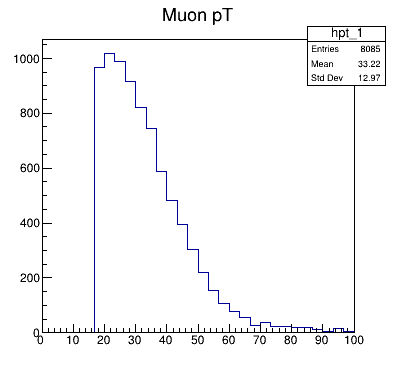
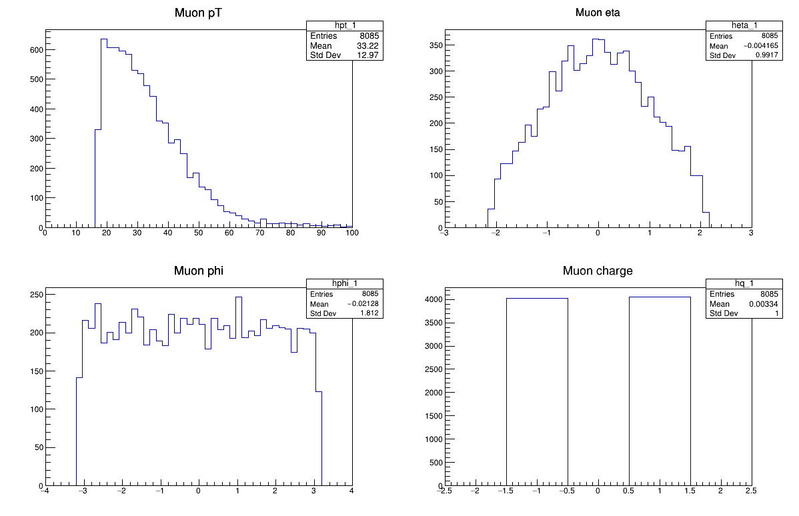
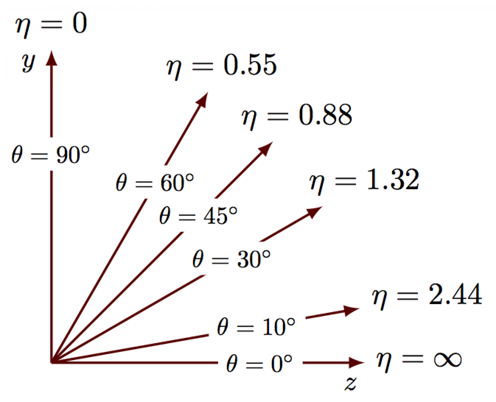
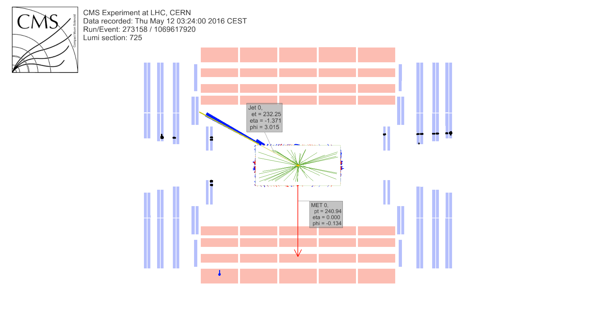
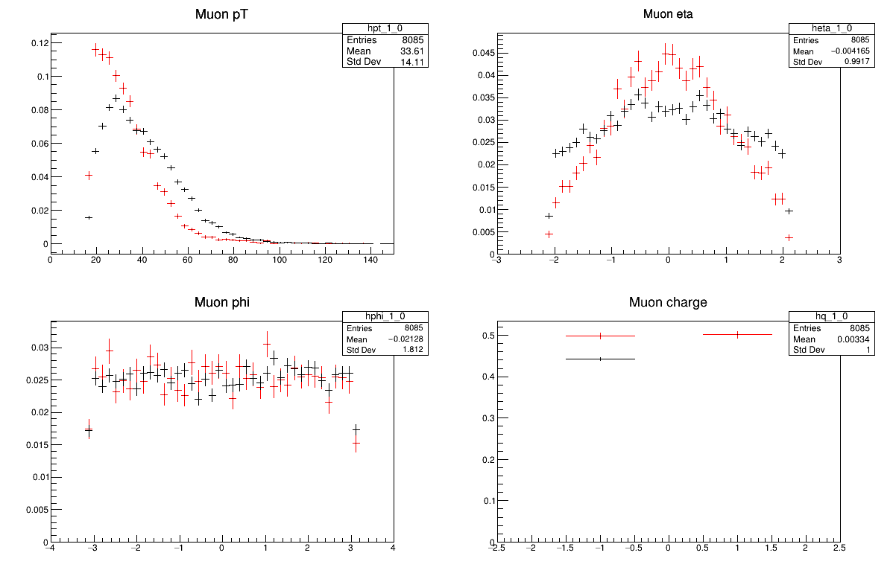
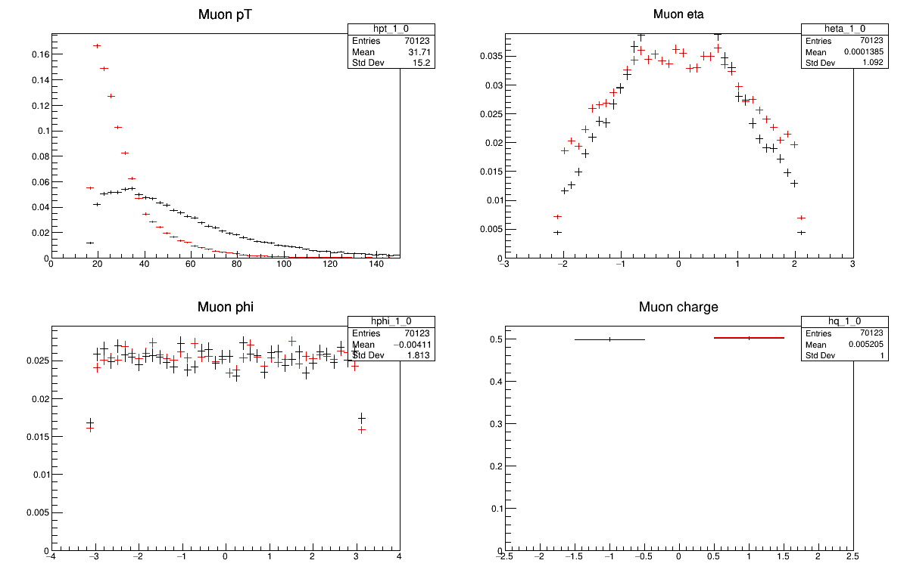

## What's in these files? 

Let's use one of the provided scripts to dump the contents of the file
to screen. We'll be using a python script that calls ROOT using the PyROOT module. 

~~~
cd /root/workshop-lesson-plotting-and-interpretation/scripts_and_data
python dump_and_plot.py GluGluToHToTauTauSkim.root
~~~
{: .language-bash}
~~~
File**		GluGluToHToTauTauSkim.root	GluGluToHToTauTauSkim.root
 TFile*		GluGluToHToTauTauSkim.root	GluGluToHToTauTauSkim.root
  KEY: TTree	Events;1	Events
******************************************************************************
*Tree    :Events    : Events                                                 *
*Entries :     8085 : Total =         1277350 bytes  File  Size =     775872 *
*        :          : Tree compression factor =   1.63                       *
******************************************************************************
*Br    0 :njets     : njets/I                                                *
*Entries :     8085 : Total  Size=      33417 bytes  File Size  =       5961 *
*Baskets :        8 : Basket Size=      32000 bytes  Compression=   5.52     *
*............................................................................*
*Br    1 :npv       : npv/I                                                  *
*Entries :     8085 : Total  Size=      33393 bytes  File Size  =       9789 *
*Baskets :        8 : Basket Size=      32000 bytes  Compression=   3.36     *
*............................................................................*
*Br    2 :pt_1      : pt_1/F                                                 *
*Entries :     8085 : Total  Size=      33405 bytes  File Size  =      29572 *
*Baskets :        8 : Basket Size=      32000 bytes  Compression=   1.11     *
*............................................................................*
*Br    3 :eta_1     : eta_1/F                                                *
*Entries :     8085 : Total  Size=      33417 bytes  File Size  =      30766 *
*Baskets :        8 : Basket Size=      32000 bytes  Compression=   1.07     *
*............................................................................*
*Br    4 :phi_1     : phi_1/F                                                *
*Entries :     8085 : Total  Size=      33417 bytes  File Size  =      30907 *
*Baskets :        8 : Basket Size=      32000 bytes  Compression=   1.07     *
*............................................................................*
.
.
.
Br   33 :jdeta     : jdeta/F                                                *
*Entries :     8085 : Total  Size=      33417 bytes  File Size  =      13696 *
*Baskets :        8 : Basket Size=      32000 bytes  Compression=   2.40     *
*............................................................................*
*Br   34 :gen_match : gen_match/O                                            *
*Entries :     8085 : Total  Size=       9204 bytes  File Size  =        933 *
*Baskets :        8 : Basket Size=      32000 bytes  Compression=   9.33     *
*............................................................................*
*Br   35 :run       : run/I                                                  *
*Entries :     8085 : Total  Size=      33393 bytes  File Size  =       1012 *
*Baskets :        8 : Basket Size=      32000 bytes  Compression=  32.53     *
*............................................................................*
*Br   36 :weight    : weight/F                                               *
*Entries :     8085 : Total  Size=      33429 bytes  File Size  =       1071 *
*Baskets :        8 : Basket Size=      32000 bytes  Compression=  30.76     *
*............................................................................*
~~~
{: .output}

Wow! There's a lot in there! We won't go through it all now, but we know there's information
in there about some of the particles used in the analysis. 

We can edit our script to loop over the individual events and make 
a histogram of the transverse momentum for one of the muons. 

Open the `dump_and_plot.py` for editing using the editor of your choice. Let's comment
out the following line by placing a `#` in front of it. 
~~~
t.Print()
~~~
{: .output}

Now, we'll uncomment a big block of code that runs over the events and fills a histogram. 
To uncomment the code, look for three `'''` that are at the beginning and end
of this code block and put a `#` in front of them.

~~~
#'''

# Create a canvas to draw on
# canvas(name, title, x (upper corner), y (upper corner), width (pixels), height (pixels))
canvas = ROOT.TCanvas("canvas","canvas",10,10,400,400)

# Divide it into 1x1 grid
canvas.Divide(1,1)

# Create a histogram to fill for the
# TH1F(name, title, # of bins, lo edge, hi edge)
hpt_1 = ROOT.TH1F("hpt_1","Muon pT",30,0,100)

# Get the number of entries in this file
nentries = t.GetEntries()

# Loop over the entries (events/collisions)
for i in range(nentries):

    # Get each entry and fill the TTree
    t.GetEvent(i)

    # Fill the histogram with each event
    hpt_1.Fill(t.pt_1)

# Go to the first block on the canvas
canvas.cd(1)
# Draw the histogram on there
hpt_1.Draw()

# We need this line for the plot to stay active sometimes
ROOT.gPad.Update()

# Save the plot as an image. This is useful in case our
# canvas doesn't stay active
canvas.SaveAs("plots/TEST_pt_1.png")
#'''
~~~
{: .language-python}

Now we'll run the code again. You can just repeat the same command as before, in which 
case it will produce a `.png` file that you can copy out of the environment. 

Or, if you were able to get X11-forwarding working, you can run it in 
interactive mode, in which case a plot will pop up!

~~~
python -i dump_and_plot.py GluGluToHToTauTauSkim.root
~~~
{: .language-bash}

You can exit the interactive python environment by typing
~~~
quit()
~~~
{: .language-python}

If you were not able to get X11 working, you'll want to copy the `plots` subdirectory
out of the environment and on to your local machine so you can inspect the figures. 

If you are running Docker you can do the following *on your local/host machine*. 

~~~
docker cp root6:/root/workshop-lesson-plotting-and-interpretation/scripts_and_data/plots .
~~~
{: .language-bash}

The `plots` directory should now be on your local machine. In there is a file `TEST_pt_1.png`. 
It should be the same image as what popped up for some of you. 

> 

> ## Challenge!
> This is the transverse momentum for some of the muons in this analysis. Why does
> it have this shape? Why do you think the momentum doesn't extend all the way down to 0? 
{: .challenge}

From here on out, it will be up to you to either reference the X11-forwarded plots or go
through the process of copying the `plots` directory on to your local machine. 

## More plots?

Let's take a look at more information for these muons, specifically the transverse momentum, 
    eta, phi, and the charge for these muons. 

Let's go back and edit the `dump_and_plot.py` script, and do the same commenting/uncommenting.
To uncomment the code, look for three `'''` that are at the beginning and end
of this code block and put a `#` in front of them.

~~~
#'''
# Create a canvas to draw on
# canvas(name, title, x (upper corner), y (upper corner), width (pixels), height (pixels))
canvas = ROOT.TCanvas("canvas","canvas",10,10,1200,800)

# Divide it into 1x1 grid
canvas.Divide(2,2)

# Create some histograms to fill for the
# TH1F(name, title, # of bins, lo edge, hi edge)
hpt_1 = ROOT.TH1F("hpt_1","Muon pT",50,0,100)
heta_1 = ROOT.TH1F("heta_1","Muon eta",50,-3,3)
hphi_1 = ROOT.TH1F("hphi_1","Muon phi",50,-4,4)
hq_1 = ROOT.TH1F("hq_1","Muon charge",5,-2.5,2.5)

# Get the number of entries in this file
nentries = t.GetEntries()

# Loop over the entries (events/collisions)
for i in range(nentries):

    # Get each entry and fill the TTree
    t.GetEvent(i)

    # Fill the histograms as we loop over each event
    hpt_1.Fill(t.pt_1)
    heta_1.Fill(t.eta_1)
    hphi_1.Fill(t.phi_1)
    hq_1.Fill(t.q_1)

# Go to each block on the canvas and draw a histogram
canvas.cd(1)
hpt_1.Draw()

canvas.cd(2)
heta_1.Draw()

canvas.cd(3)
hphi_1.Draw()

canvas.cd(4)
hq_1.Draw()

# We need this line for the plot to stay active sometimes
ROOT.gPad.Update()

# Save the plot as an image. This is useful in case our
# canvas doesn't stay active
canvas.SaveAs("plots/TEST_muon_plots.png")

#'''
~~~
{: .language-python}

Run it on that same file.
~~~
python -i dump_and_plot.py GluGluToHToTauTauSkim.root
~~~
{: .language-bash}

> ## Challenge!
> How about these plots? Why do they have the shapes that they do? 
> > ## Hint!
> > - | -
> >  | 
> {: .solution}
{: .challenge}

> ## Challenge!
> What about some of the other files? Do they look the same if you run on them? For example
> ~~~
> python -i dump_and_plot.py W1JetsToLNuSkim.root
> ~~~
> {: .language-bash}
{: .challenge}

## Compare some physics processes

If you ran the last challenge, you know that it would be useful to compare 
some of these distributions side-by-side for different physics processes. 

We've provided a script that does this by *normalizing* the histograms and overlaying them. 
Since there are different numbers of events in each dataset, we need to normalize them
for easier comparison. You won't need to edit this script to run, but you are welcome to 
look at the code to get a sense of what is happening. 

~~~
python -i compare_two_files.py GluGluToHToTauTauSkim.root W1JetsToLNuSkim.root
~~~
{: .language-bash}

The red markers are the first file you pass in and the black markers are the second. 

Or how about two other distributions?
~~~
python -i compare_two_files.py DYJetsToLLSkim.root TTbarSkim.root
~~~
{: language-bash}

> ## Challenge!
> Why do these all look different? Is there anything you expect to be the same? 
{: .challenge}



