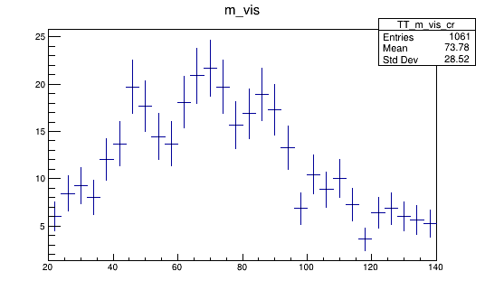
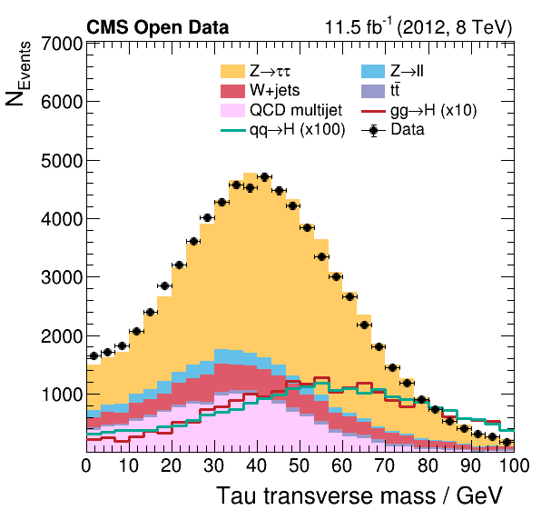
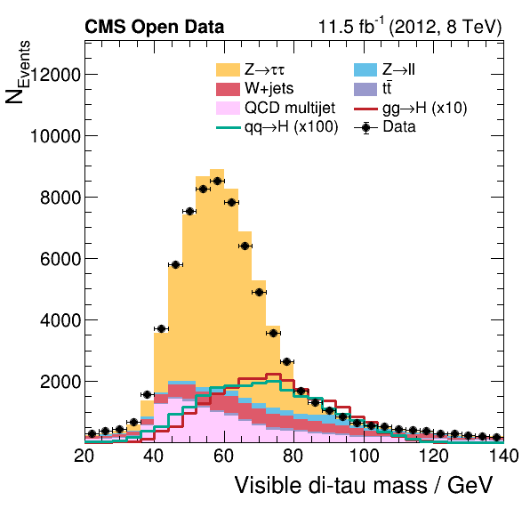
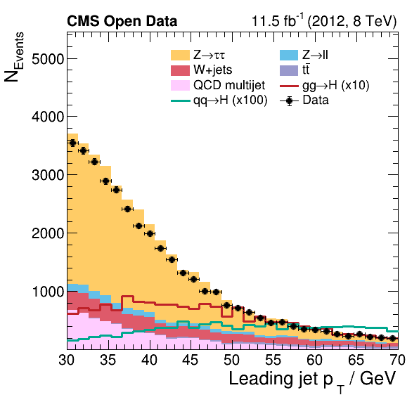
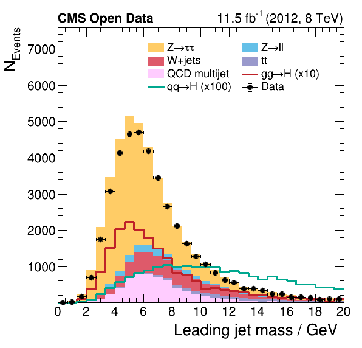

## Processing our events

In the [Higgs to tau tau](http://opendata.cern.ch/record/12350) analysis, one runs over
* Background Monte Carlo samples
* The signal Monte Carlo samples
* The collision data
And then compares 30+ observables to see if the sum of the Monte Carlo is in agreement
with the data. 

In order to compare them, we need to know
* What integrated luminosity does the data represent?
* How many Monte Carlo events were produced? 
* What is the cross section for the background Monte Carlo samples? 

We need those last two so we can scale the Monte Carlo to match up with
the data luminosity. 

That's a lot to keep track of!

Fortunately, we've provided you with a script that will produce all the necessary 
files. In the first step, we run over all our datasets and produce ROOT files 
that contain the *histograms* of our 30+ observables, weighted appropriately. 

We can run this as follows.

~~~
cd /root/workshop-lesson-plotting-and-interpretation/scripts_and_data
python histograms.py 
~~~
{: .language-bash}
~~~
.
.
<warnings we can ignore> 
.
.
>> Process skimmed sample GluGluToHToTauTau for process ggH
Cut-flow report (signal region):
Muon transverse mass cut for W+jets suppression: pass=5591       all=8085       -- eff=69.15 % cumulative eff=69.15 %
Require isolated muon for signal region: pass=4990       all=5591       -- eff=89.25 % cumulative eff=61.72 %
Require opposited charge for signal region: pass=4913       all=4990       -- eff=98.46 % cumulative eff=60.77 %
Cut-flow report (control region):
Muon transverse mass cut for W+jets suppression: pass=5591       all=8085       -- eff=69.15 % cumulative eff=69.15 %
Require isolated muon for signal region: pass=4990       all=5591       -- eff=89.25 % cumulative eff=61.72 %
Control region for QCD estimation: pass=77         all=4990       -- eff=1.54 % cumulative eff=0.95 %
>>> Process skimmed sample VBF_HToTauTau for process qqH
Cut-flow report (signal region):
Muon transverse mass cut for W+jets suppression: pass=7129       all=10492      -- eff=67.95 % cumulative eff=67.95 %
Require isolated muon for signal region: pass=6562       all=7129       -- eff=92.05 % cumulative eff=62.54 %
Require opposited charge for signal region: pass=6420       all=6562       -- eff=97.84 % cumulative eff=61.19 %
Cut-flow report (control region):
Muon transverse mass cut for W+jets suppression: pass=7129       all=10492      -- eff=67.95 % cumulative eff=67.95 %
Require isolated muon for signal region: pass=6562       all=7129       -- eff=92.05 % cumulative eff=62.54 %
Control region for QCD estimation: pass=142        all=6562       -- eff=2.16 % cumulative eff=1.35 %
.
.
.
>>> Process skimmed sample Run2012B_TauPlusX for process dataRunB
Cut-flow report (signal region):
Muon transverse mass cut for W+jets suppression: pass=64837      all=136060     -- eff=47.65 % cumulative eff=47.65 %
Require isolated muon for signal region: pass=37378      all=64837      -- eff=57.65 % cumulative eff=27.47 %
Require opposited charge for signal region: pass=28309      all=37378      -- eff=75.74 % cumulative eff=20.81 %
Cut-flow report (control region):
Muon transverse mass cut for W+jets suppression: pass=64837      all=136060     -- eff=47.65 % cumulative eff=47.65 %
Require isolated muon for signal region: pass=37378      all=64837      -- eff=57.65 % cumulative eff=27.47 %
Control region for QCD estimation: pass=9069       all=37378      -- eff=24.26 % cumulative eff=6.67 %
>>> Process skimmed sample Run2012C_TauPlusX for process dataRunC
Cut-flow report (signal region):
Muon transverse mass cut for W+jets suppression: pass=99497      all=210462     -- eff=47.28 % cumulative eff=47.28 %
Require isolated muon for signal region: pass=60162      all=99497      -- eff=60.47 % cumulative eff=28.59 %
Require opposited charge for signal region: pass=45644      all=60162      -- eff=75.87 % cumulative eff=21.69 %
Cut-flow report (control region):
Muon transverse mass cut for W+jets suppression: pass=99497      all=210462     -- eff=47.28 % cumulative eff=47.28 %
Require isolated muon for signal region: pass=60162      all=99497      -- eff=60.47 % cumulative eff=28.59 %
Control region for QCD estimation: pass=14518      all=60162      -- eff=24.13 % cumulative eff=6.90 %
~~~
{: .output}

This produces a file `histograms.root` that has all these histograms in it. 
We can examine this with ROOT, even without X11 forwarding. 

~~~
root histograms.root
~~~
{: .language-bash}

Once we're in the ROOT CINT, we can do the following to see all the histograms in there!

~~~
_file0->ls()
~~~
{: .code}
~~~
TFile**		histograms.root
 TFile*		histograms.root
  KEY: TH1D	ggH_pt_1;1	pt_1
  KEY: TH1D	ggH_pt_2;1	pt_2
  KEY: TH1D	ggH_eta_1;1	eta_1
  KEY: TH1D	ggH_eta_2;1	eta_2
  KEY: TH1D	ggH_phi_1;1	phi_1
  KEY: TH1D	ggH_phi_2;1	phi_2
  KEY: TH1D	ggH_iso_1;1	iso_1
  KEY: TH1D	ggH_iso_2;1	iso_2
  KEY: TH1D	ggH_q_1;1	q_1
  KEY: TH1D	ggH_q_2;1	q_2
  KEY: TH1D	ggH_pt_met;1	pt_met
  KEY: TH1D	ggH_phi_met;1	phi_met
.
.
.
 KEY: TH1D	qqH_phi_met_cr;1	phi_met
  KEY: TH1D	qqH_m_1_cr;1	m_1
  KEY: TH1D	qqH_m_2_cr;1	m_2
  KEY: TH1D	qqH_mt_1_cr;1	mt_1
  KEY: TH1D	qqH_mt_2_cr;1	mt_2
  KEY: TH1D	qqH_dm_2_cr;1	dm_2
  KEY: TH1D	qqH_m_vis_cr;1	m_vis
  KEY: TH1D	qqH_pt_vis_cr;1	pt_vis
  KEY: TH1D	qqH_jpt_1_cr;1	jpt_1
  KEY: TH1D	qqH_jpt_2_cr;1	jpt_2
  KEY: TH1D	qqH_jeta_1_cr;1	jeta_1
  KEY: TH1D	qqH_jeta_2_cr;1	jeta_2
  KEY: TH1D	qqH_jphi_1_cr;1	jphi_1
  KEY: TH1D	qqH_jphi_2_cr;1	jphi_2
  KEY: TH1D	qqH_jm_1_cr;1	jm_1
  KEY: TH1D	qqH_jm_2_cr;1	jm_2
  KEY: TH1D	qqH_jbtag_1_cr;1	jbtag_1
  KEY: TH1D	qqH_jbtag_2_cr;1	jbtag_2
  KEY: TH1D	qqH_npv_cr;1	npv
  KEY: TH1D	qqH_njets_cr;1	njets
  KEY: TH1D	qqH_mjj_cr;1	mjj
  KEY: TH1D	qqH_ptjj_cr;1	ptjj
  KEY: TH1D	qqH_jdeta_cr;1	jdeta
~~~
{: .output}

We can look at one of these histograms, but on it's own it's not that interesting. 

## Compare Monte Carlo and data

Now we want to compare Monte Carlo and data but we need to label everything correctly and keep
track of things carefully and that's really hard! Fortunately, we've provided 
you with a script. Just like the previous command, the expected input filename is hardcoded. 

~~~
python plot.py
~~~
{: .language-bash}
~~~
Info in <TCanvas::Print>: pdf file plots/pt_1.pdf has been created
Info in <TCanvas::Print>: png file plots/pt_1.png has been created
Info in <TCanvas::Print>: pdf file plots/pt_2.pdf has been created
Info in <TCanvas::Print>: png file plots/pt_2.png has been created
Info in <TCanvas::Print>: pdf file plots/eta_1.pdf has been created
Info in <TCanvas::Print>: png file plots/eta_1.png has been created
Info in <TCanvas::Print>: pdf file plots/eta_2.pdf has been created
Info in <TCanvas::Print>: png file plots/eta_2.png has been created
Info in <TCanvas::Print>: pdf file plots/phi_1.pdf has been created
Info in <TCanvas::Print>: png file plots/phi_1.png has been created
Info in <TCanvas::Print>: pdf file plots/phi_2.pdf has been created
Info in <TCanvas::Print>: png file plots/phi_2.png has been created
Info in <TCanvas::Print>: pdf file plots/pt_met.pdf has been created
Info in <TCanvas::Print>: png file plots/pt_met.png has been created
Info in <TCanvas::Print>: pdf file plots/phi_met.pdf has been created
Info in <TCanvas::Print>: png file plots/phi_met.png has been created
.
.
.
Info in <TCanvas::Print>: png file plots/jphi_2.png has been created
Info in <TCanvas::Print>: pdf file plots/jm_1.pdf has been created
Info in <TCanvas::Print>: png file plots/jm_1.png has been created
Info in <TCanvas::Print>: pdf file plots/jm_2.pdf has been created
Info in <TCanvas::Print>: png file plots/jm_2.png has been created
Info in <TCanvas::Print>: pdf file plots/jbtag_1.pdf has been created
Info in <TCanvas::Print>: png file plots/jbtag_1.png has been created
Info in <TCanvas::Print>: pdf file plots/jbtag_2.pdf has been created
Info in <TCanvas::Print>: png file plots/jbtag_2.png has been created
Info in <TCanvas::Print>: pdf file plots/npv.pdf has been created
Info in <TCanvas::Print>: png file plots/npv.png has been created
Info in <TCanvas::Print>: pdf file plots/njets.pdf has been created
Info in <TCanvas::Print>: png file plots/njets.png has been created
~~~
{: .output}

Now we can take a look and see how good the comparison is!

- | -
 | 
| 

Pretty good agreement! However, for a full analysis, there's more to be done.
From the open data portal record...

> ## More to do!
> For completeness, the following points describe the missing steps to 
> extract from the data a meaningful statistical result. 
> Please note that these steps typically take most of the time of a 
> physics analysis and are not included in this example.
>
> * The simulation has to be improved with corrections to reflect the data precisely. 
> For example, a typical correction is the calibration of the energy measurement 
> of tau leptons or jets. Each correction comes with a systematic uncertainty, 
> which has to be included in the measurement.
>
> * As the final step, a measurement is performed with a fit of a statistical model 
> to the data. This model incorporates the expectation from a physics model, 
> for example the Standard Model, and all statistical and systematic uncertainties. 
> Typical systematic uncertainties are the uncertainties of the amount of 
> expected background events or the theory of the physics model.
{: .callout}

But that's for another time!



